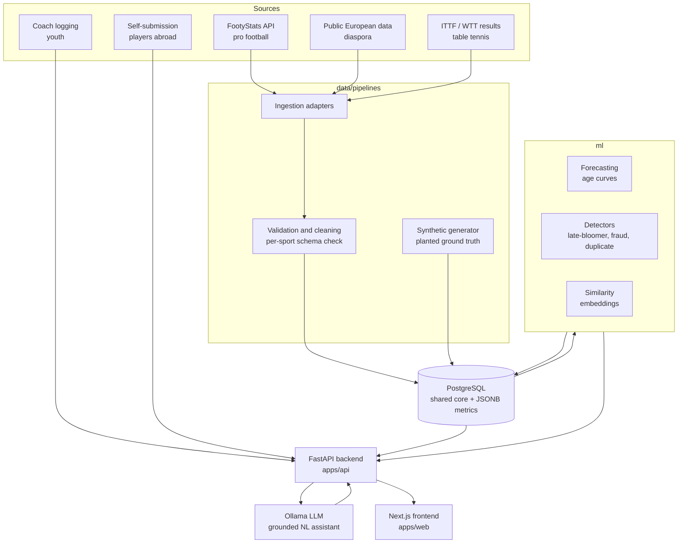
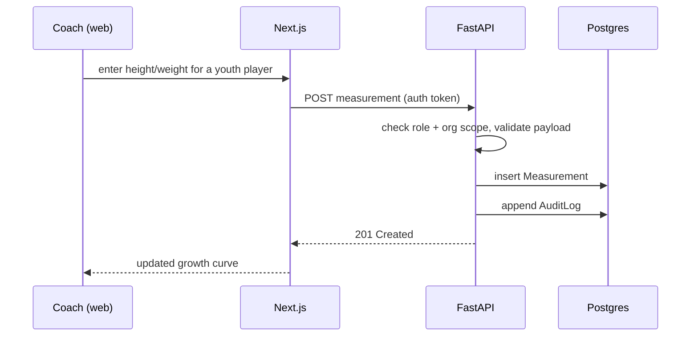

# NorthStar architecture

A high-level map of how the pieces fit together. Read this after the README and before you
start building. For the data contract, see [schema.md](schema.md).

## The one idea to hold onto

**Shared core, pluggable sport modules.** Everything common across sports (player identity,
biometrics, time-series, organizations, users) is normal relational data. Everything
sport-specific (a football shot map, a table tennis rally distribution) is a JSON payload
validated by a per-sport schema. Football is the deep implementation. Table tennis exists to
prove the core generalizes. If adding table tennis had required schema migrations, the
design would have failed. It does not, so it works.

## System overview

## Components

### Data sources
Five inputs feed the platform. Three are pull-based (FootyStats API for pro football, public
European data for diaspora, ITTF/WTT scraping for table tennis) and two are push-based (coach
logging and player self-submission through the app). The synthetic generator is a sixth,
development-only source that seeds realistic data with planted ground-truth cases so the ML
and detection work has something to measure against before real data arrives.

### Ingestion pipelines (`data/pipelines`)
Each source has an adapter that normalizes its data into the shared core shape. Everything
then passes through one **validation and cleaning** layer that checks core fields and
validates sport-specific `metrics` against the per-sport JSON schema in `packages/shared`.
Only validated data reaches the database, with the outcome recorded on each row.

### Database (PostgreSQL)
The single source of truth. Shared core in relational tables, sport-specific performance in
`JSONB`. See [schema.md](schema.md). SQLAlchemy 2.0 models live in the API; Alembic owns
migrations.

### ML layer (`ml`)
Reads from the database, writes results (forecasts, flags, similarity, embeddings) back to
it. Forecasting with uncertainty, per-position age curves, late-bloomer detection via
maturity offset, xG-vs-actual sustainability flags, similarity via sentence-transformer
embeddings, and anomaly detection that crosses over with the security workstream. Every
model ships with an evaluation harness measuring against the targets in the README.

### LLM assistant (Ollama)
A locally hosted model answers natural-language questions, grounded in data the API
retrieves rather than free-form generation. It never invents player data; it phrases what
the database and ML layer already know. Heavy to run, so it is optional in local dev.

### API (`apps/api`, FastAPI)
The one gateway to the data. Serves the frontend, receives coach logging and self-submission,
enforces access control, writes the audit log, and orchestrates calls into the ML layer and
the LLM. All read and write policy lives here, not in the frontend.

### Web app (`apps/web`, Next.js)
Responsive, mobile-first for coach logging. Role-based screens: login, coach dashboard,
add/edit player, the player profile page (the crown jewel: growth curves, trend charts,
forecast with uncertainty band, percentile bars, flags, AI summary), scout search with
semantic query plus filters, comparison view, federation oversight, and an integrity board.

## Request flow: coach logs a measurement

## How the workstreams map to the code

| Workstream        | Primary directories                                  |
| ----------------- | ---------------------------------------------------- |
| Data engineering  | `data/pipelines`, `data/migrations`, `apps/api` models |
| Intelligence / ML | `ml`, plus read/write against the API and DB         |
| Security          | `apps/api` (auth, RBAC, audit), `docs/threat-model.md` |
| Application       | `apps/web`, `apps/api` endpoints, `packages/shared`  |

## Deployment (local dev today)

`docker-compose` brings up Postgres, the API, the web app, and an optional Ollama service.
See the README for commands. Production deployment is out of scope for the foundation stage;
GitHub Actions CI comes later. TODO: CI pipeline, staging environment.

## Decisions

Significant choices are recorded in [decisions/](decisions/) as short numbered notes. The
first one captures the shared-core principle.
